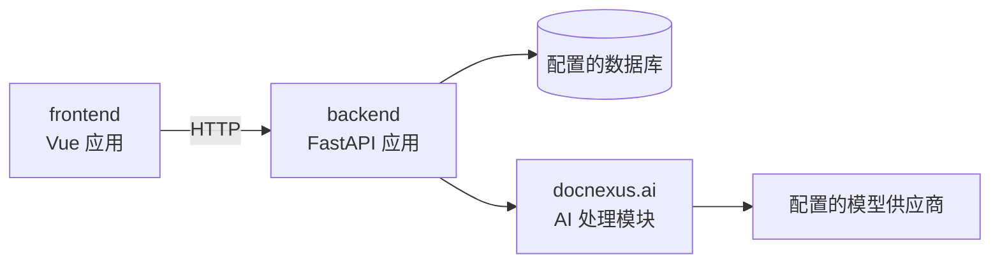

# 系统架构

## 系统边界



`frontend` 通过 HTTP API 与服务端交互。`backend` 负责身份认证、数据持久化、
任务编排、文档处理和 AI 调用。

## 后端分层

```text
docnexus/
|-- api/
|   |-- dependencies.py      # 身份认证与授权依赖
|   |-- router.py            # 路由聚合
|   `-- routes/              # 按 HTTP 能力拆分的路由模块
|-- ai/
|   |-- workflows.py         # 路由调用的稳定 AI 工作流门面
|   |-- contracts.py         # AI 工作流输入输出契约
|   |-- knowledge_graph/     # 知识图谱领域
|   `-- table_engine/        # 解析、检索、填表与校验流水线
|-- core/                    # 配置与安全基础能力
|-- db/                      # 模型、会话、初始化和迁移兼容
|-- repositories/            # 持久化操作
|-- schemas/                 # HTTP 传输契约
|-- services/                # 应用服务
`-- main.py                  # 应用工厂与静态资源集成
```

依赖方向由外向内：路由可以调用应用服务、仓储和 AI 工作流门面；仓储调用数据库
层。AI 模块不得导入 FastAPI 路由或前端代码。

## 兼容性保证

- 路由契约测试保护现有公开 API 路径；
- 保留现有前端路由和请求数据结构；
- 开发数据库默认仍为 `./doc_system.db`；
- 生产数据库位置通过 `DATABASE_URL` 配置。
