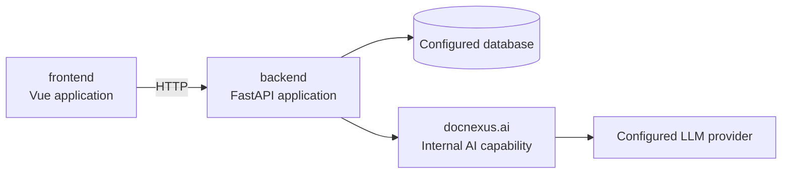

# Architecture overview

## System boundaries



`frontend` consumes the published HTTP contract. `backend` owns transport,
authentication, persistence, application orchestration, and server-side AI.
AI is kept as an internal module because it shares the backend release cycle
and is not independently published.

## Backend layers

```text
docnexus/
├── api/
│   ├── dependencies.py      # Authentication and authorization dependencies
│   ├── router.py            # Router composition
│   └── routes/              # One module per HTTP capability
├── ai/
│   ├── workflows.py         # Stable AI workflow facade used by routes
│   ├── contracts.py         # AI workflow input and output contracts
│   ├── knowledge_graph/     # Knowledge graph domain
│   └── table_engine/        # Parsing, retrieval, filling, and verification
├── core/                    # Settings and security primitives
├── db/                      # Models, sessions, bootstrap, and migration support
├── repositories/            # Persistence operations
├── schemas/                 # HTTP transport contracts
├── services/                # Application services
└── main.py                  # Application factory and static-file integration
```

Dependency direction is inward: routes call services, repositories, and the
AI workflow facade; repositories call the database layer. AI modules do not
import FastAPI route modules or frontend code.

## Compatibility guarantees

- Existing public API paths are protected by a route-contract test.
- Existing frontend routes and request payloads are preserved.
- The development database default remains `./doc_system.db`.
- Production database location is configured through `DATABASE_URL`.
