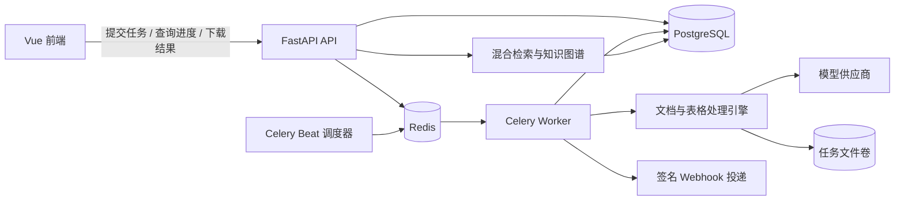

# 系统架构


```mermaid
flowchart LR
    Web["Vue 前端"] -->|"提交任务 / 查询进度 / 下载结果"| API["FastAPI API"]
    API --> PG[("PostgreSQL")]
    API --> Redis[("Redis")]
    Redis --> Worker["Celery Worker"]
    Scheduler["Celery Beat 调度器"] --> Redis
    Worker --> AI["文档与表格处理引擎"]
    Worker --> PG
    Worker --> Webhook["签名 Webhook 投递"]
    AI --> LLM["模型供应商"]
    AI --> Files[("任务文件卷")]
    API --> Knowledge["混合检索与知识图谱"]
    Knowledge --> PG
```

耗时 AI 操作不占用 HTTP 请求生命周期。API 完成鉴权和文件安全校验后创建任务，
Worker 从 Redis 取任务执行，并将真实节点事件、进度、证据、质量结果、重试次数和错误写入 PostgreSQL。
调度器按 Cron 计划扫描到期工作流，Webhook 投递记录包含签名、响应状态与失败原因。

## 后端分层

```text
docnexus/
|-- api/                     # HTTP 路由、鉴权与任务接口
|-- ai/                      # 文档、提取和表格处理领域能力
|-- core/                    # 配置、安全与限流
|-- db/                      # SQLAlchemy 模型和会话
|-- repositories/            # 用户隔离的数据访问
|-- schemas/                 # HTTP 传输契约
|-- services/                # 文件解析、质量、知识检索、调度与回调
|-- worker/                  # Celery 任务执行器
`-- main.py                  # ASGI 应用工厂
```

数据库结构由 `backend/alembic` 中的版本迁移管理。每条提取记录和任务都必须归属于
用户；下载、查询、取消和删除均再次校验所有权。

## 任务状态

任务状态按 `queued → running → succeeded/failed/cancelled` 变化。进度只在真实节点开始或
完成时更新，不按等待时间模拟。失败任务按配置自动
重试；用户也可对失败或取消的任务重新提交。Worker 使用软、硬超时和延迟确认，
容器异常退出后消息会重新投递。
