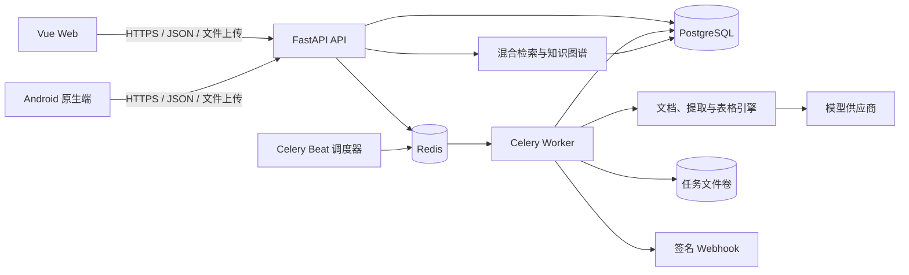

# 系统架构

## 总体结构


```mermaid
flowchart LR
    Web["Vue Web"] -->|"HTTPS / JSON / 文件上传"| API["FastAPI API"]
    Android["Android 原生端"] -->|"HTTPS / JSON / 文件上传"| API
    API --> PG[("PostgreSQL")]
    API --> Redis[("Redis")]
    Redis --> Worker["Celery Worker"]
    Scheduler["Celery Beat 调度器"] --> Redis
    Worker --> Engine["文档、提取与表格引擎"]
    Worker --> PG
    Worker --> Files[("任务文件卷")]
    Worker --> Webhook["签名 Webhook"]
    Engine --> LLM["模型供应商"]
    API --> Knowledge["混合检索与知识图谱"]
    Knowledge --> PG
```

Web 与 Android 是同一业务平台的两个客户端，共用认证、任务、文档工作台和企业平台接口。客户端只负责交互、展示与本地会话状态，业务事实以服务端数据为准。

## 请求与任务生命周期

1. 客户端提交认证信息、任务参数和文件；
2. API 完成鉴权、用户或组织隔离、文件安全校验与参数校验；
3. API 写入任务记录并将异步任务投递至 Redis；
4. Worker 执行真实处理节点，并写入进度、时间线、证据、质量结果和错误；
5. 客户端轮询或刷新任务状态，并在成功后下载交付物；
6. 需要外部集成时，Worker 按配置投递带签名的 Webhook。

耗时 AI 操作不占用 HTTP 请求生命周期。任务状态按 `queued → running → succeeded/failed/cancelled` 变化，进度只在真实节点状态变化时更新，不按等待时间模拟。

## 后端分层

```text
docnexus/
|-- api/                     # HTTP 路由、鉴权与请求依赖
|-- ai/                      # 文档、提取、表格、RAG 与图谱能力
|-- core/                    # 配置、安全、限流和可观测性
|-- db/                      # SQLAlchemy 模型和会话
|-- repositories/            # 带所有权隔离的数据访问
|-- schemas/                 # HTTP 传输契约
|-- services/                # 文件、质量、调度、企业与回调服务
|-- worker/                  # Celery 任务执行器
`-- main.py                  # ASGI 应用入口
```

数据库结构由 `backend/alembic` 中的迁移管理。下载、查询、取消、重试和删除都必须重新校验资源所有权，不能只依赖客户端传入的 ID。

## 客户端分层

- Web：路由页面调用 Pinia Store 或 API 模块，HTTP 客户端统一处理令牌和错误；
- Android：Composable 只表达 UI 和用户事件，ViewModel 管理状态，Repository 负责远程数据访问；
- 两端应对齐业务能力和视觉语言，但遵循各平台的导航、权限、文件选择和生命周期规范。

## 网络环境

- Web 开发服务器通过 Vite 代理访问 API；
- Android 模拟器使用 `10.0.2.2` 访问宿主机；
- Android 真机本地调试可使用 `adb reverse`，仅限开发连接；
- 生产 Web 与 Android 必须使用受信任证书的 HTTPS API，不应依赖局域网地址或 ADB 隧道。

## 可靠性与可观测性

Worker 使用软硬超时、延迟确认和有限重试；容器异常退出后，未确认消息可以重新投递。健康检查区分存活与就绪，Prometheus 指标由 `/metrics` 暴露。日志、任务时间线和 Webhook 投递记录共同用于问题定位。
